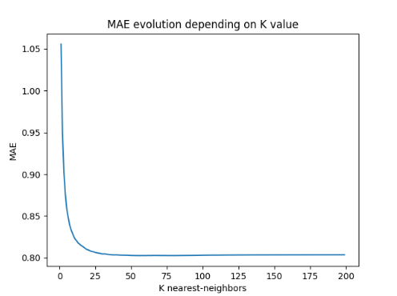
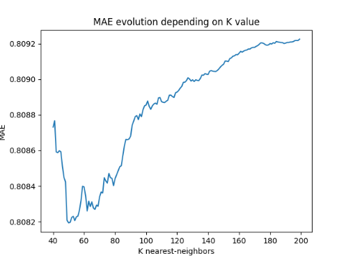
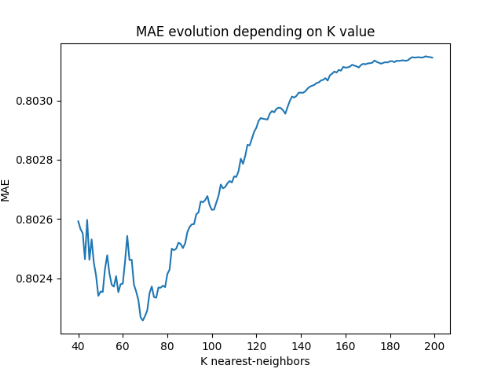

1. Given this data set and the algorithm of K-NN explained in class for user-based CF:

a) Find out the value for K that minimizes the MAE with 25% of missing ratings.

First of all, it's good to remind us our main goal: based on a dataset, predict the ratings of all items not rated yet
by a given user, and for all users. After that, we just want to recommend to user the top N items with the highest
predicted rating by expecting that he will like them (and then increase chances to sell the item for example). Of
course, according to algorithms used, the results can vary.

The objective for this first step is to test different values of K for K-NN algorithm and examine the results. We want
the lowest K that minimizes the MAE. We start here with 25% of missing ratings which mean that we define a training
dataset for the algorithm of 75% or ratings and a test one of 25% of the remaining ones.

Because we use here K-NN algorithm, we must select the similarity function to use. We are going to use here the
"Pearson" one in our case study.

To realize this, we set up this program by following these preliminary steps:

```python
# Load the movielens-100k dataset
data = Dataset.load_builtin('ml-100k')

# Split dataset in two ones: one for training, the other one to realize tests
# (to determine MAE or top-N items for example)
train_set, test_set = train_test_split(data, test_size=.25)

# Use the "Pearson" similarity function for K-NN algorithm
sim_options_knn = {
    'name': "pearson",
    'user_based': True  # compute similarities between users
}
```

Next, we run the K-NN algorithm several times with different values of K in order to determine MAEs values:

```python
# Adjust range values according to the experience to realize
k_list = list(range(40, 50, 1))

# Store MAEs values to display them later
maes = []

for k in k_list:
    algo = KNNBasic(k=k, sim_options=sim_options_knn)
    predictions = algo.fit(train_set).test(test_set)
    maes.append(mae(predictions))
```

Then, we display the result in a plot with MatPlotLib library:

```python
pyplot.plot(k_list, maes)
pyplot.title('MAE evolution depending on K value')
pyplot.xlabel('K nearest-neighbors')
pyplot.ylabel('MAE')
pyplot.show()
```

Now, we just need to change k_list in order to find the sought K-value for the given context of ratings.

***Note:** for the following experiments, we use the dichotomy approach (manually executed) to determine the K value.*

We can try with `k_list = list(range(10, 10000, 1000))` as a first try, we see the following result:  


We see that when `K > 1000`, then MAE is equal to `0.8015` constantly. So we conclude here that the K shouldn't
overflow `1000` as value.

Let's try analyzing MAE values with K < 1000 with a new k_list: `k_list = list(range(10, 1000, 100))`:  


Here we have make calculations a second time to verify the stability of the phenomenon observed. Of course, additional
ones can improve the precision and certainty of this observation. We observe here that the K value must not be too low,
but not too high either. So, we conclude that `10 < K < 200`.

Let's try analyzing MAE values with a new k_list: `k_list = list(range(10, 200, 10))`:  


Again, it seems to confirm the phenomenon observed previously with these two other experiments. We conclude here
that `40 < K < 100`. Another experiment with `k_list = list(range(40, 100, 5))`:  


Here we see that it become harder to exclude values of K that can't be the lowest because of the unstable behavior of
the curve between 40 and 80. This is why we are going to stop using dichotomy approach and use another one:
probabilistic analysis. For the k_list defined as follows: `k_list = list(range(40, 80, 4))`, we relaunch calculations
30 times in order to permit quantitative analysis in order to conclude about which value of K we may use. We set a step
of 4 in order to make tests faster even if we lose a bit of precision. Anyway, this is just a case study so this last
criterion does not highly constraint us. We assume that the ideas explained and steps followed here are more important.

This is a snippet of the developed algorithm:

```python
# Number of experiments (>= 30 to permit quantitative analysis)
n = 30

# We focus on the range of values of K where MAEs remain unstable
k_list = list(range(40, 80, 4))

# Matrix of MAEs values: row correspond to an experiment and column to a K value
# A way to read a cell: for the experiment n°X with K=Y the MAE value is equal to Z (the value of the cell)
m_maes = np.zeros((n, len(k_list)))

for i in range(0, n, 1):
    # Split dataset in two ones: one for training, the other one to realize tests
    # (to determine MAE or top-N items for example)
    train_set, test_set = train_test_split(data, test_size=.25)

    # Store MAEs values of the current experiment
    maes = []

    for k in k_list:
        algo = KNNBasic(k=k, sim_options=sim_options_knn)
        predictions = algo.fit(train_set).test(test_set)
        maes.append(mae(predictions))

    # Update the corresponding in the matrix of MAEs values
    m_maes[i, :] = maes

# Best K information
best_k_index = -1
best_k_mae_value = 0

average_maes_per_k = np.zeros(len(k_list))

# Analyse MAEs values for each K and search the best one
for k_index in range(0, len(k_list), 1):
    k_maes = m_maes[:, k_index]
    average_maes = sum(k_maes) / len(k_maes)
    average_maes_per_k[k_index] = average_maes
    if k_index == 0 or average_maes < best_k_mae_value:
        best_k_index = k_index
        best_k_mae_value = average_maes
    print("K={}, average MAEs={}".format(k_list[k_index], average_maes))

# Display the best value of K
if best_k_index >= 0:
    best_k = 40 + best_k_index * 4
    print("Best K: {}, average MAEs: {}".format(best_k, best_k_mae_value))
else:
    print("No best K found")

# Plot a curve of average MAEs per K
plot_maes(k_list, average_maes_per_k)
```

When running it, we obtain the following results:

```
K=40, average MAEs=0.8059287110554011
K=44, average MAEs=0.8057077602282138
K=48, average MAEs=0.8055491029694546
K=52, average MAEs=0.8054369597826778
K=56, average MAEs=0.8053985015884169
K=60, average MAEs=0.8053677454013536
K=64, average MAEs=0.8053894656489773
K=68, average MAEs=0.8054018452040784
K=72, average MAEs=0.8054459548081628
K=76, average MAEs=0.8054883515342929
Best K: 60, average MAEs: 0.8053677454013536
```


Like we can see, the curve seem to be more stable and smooth. If we do experiment with only n=1 the difference is
blatant:  


Finally, we found the better value of K according to the steps followed until now and the use of MAE as measure.

The results may vary if we use another measure like RMSE but in this case study we are not going to experiment it in
order to compare both measures.

## Increase precision

We made other experiments with a higher precision, but more calculation time. The following experiments use the
probabilistic approach.

We start a first experiment with `k_list = list(range(1, 200, 1))` and we obtain the following results:

```
K=1, average MAEs=1.0554657893333335
K=2, average MAEs=0.9483158489252804
K=3, average MAEs=0.9027292571846226
K=4, average MAEs=0.8759974495102928
K=5, average MAEs=0.858438736078818
K=6, average MAEs=0.8482671824900299
K=7, average MAEs=0.8394131995654158
K=8, average MAEs=0.8335609107077737
K=9, average MAEs=0.8293987058181528
K=10, average MAEs=0.8250854653355167
K=11, average MAEs=0.8219967871028724
K=12, average MAEs=0.8201183587478358
K=13, average MAEs=0.8175642411133148
K=14, average MAEs=0.8163811329325511
K=15, average MAEs=0.8146884394017206
K=16, average MAEs=0.813801614247994
K=17, average MAEs=0.812480393642851
K=18, average MAEs=0.8111168785366626
K=19, average MAEs=0.809965996910143
K=20, average MAEs=0.8094015885865722
K=21, average MAEs=0.8086223971776061
K=22, average MAEs=0.8078709840367098
K=23, average MAEs=0.8074227124735835
K=24, average MAEs=0.8070685101791975
K=25, average MAEs=0.8063479097921835
K=26, average MAEs=0.806103143488919
K=27, average MAEs=0.8056180906784911
K=28, average MAEs=0.80547662239942
K=29, average MAEs=0.8049614412071262
K=30, average MAEs=0.8046217226444844
K=31, average MAEs=0.8047806313043815
K=32, average MAEs=0.8045836549010316
K=33, average MAEs=0.8043756395105731
K=34, average MAEs=0.8040475894229856
K=35, average MAEs=0.8037412956949844
K=36, average MAEs=0.8037008100175289
K=37, average MAEs=0.8034724975055596
K=38, average MAEs=0.8035083111755584
K=39, average MAEs=0.8035648124783408
K=40, average MAEs=0.8035126595025421
K=41, average MAEs=0.8033512671759233
K=42, average MAEs=0.8032316973337246
K=43, average MAEs=0.8031825097902617
K=44, average MAEs=0.8031859953071099
K=45, average MAEs=0.8030073348146513
K=46, average MAEs=0.8030885425034768
K=47, average MAEs=0.803088488339805
K=48, average MAEs=0.802969860839623
K=49, average MAEs=0.8029027131417164
K=50, average MAEs=0.802809634797748
K=51, average MAEs=0.8027959022675033
K=52, average MAEs=0.8027422863370773
K=53, average MAEs=0.8026775797797253
K=54, average MAEs=0.8026839581498265
K=55, average MAEs=0.8026678957685355
K=56, average MAEs=0.8026363318561291
K=57, average MAEs=0.8026665601328108
K=58, average MAEs=0.8027303010547377
K=59, average MAEs=0.8026613563555935
K=60, average MAEs=0.8027085063391662
K=61, average MAEs=0.8027430864596486
K=62, average MAEs=0.8027765139478644
K=63, average MAEs=0.802709104611838
K=64, average MAEs=0.802785382419824
K=65, average MAEs=0.8028078215237343
K=66, average MAEs=0.8027824404895721
K=67, average MAEs=0.8027825876444992
K=68, average MAEs=0.8028002736052747
K=69, average MAEs=0.8028096130801017
K=70, average MAEs=0.8027982995663419
K=71, average MAEs=0.8027453415542313
K=72, average MAEs=0.8027291186222425
K=73, average MAEs=0.8027139695719703
K=74, average MAEs=0.8026614904829381
K=75, average MAEs=0.8026468521946248
K=76, average MAEs=0.8026941304311215
K=77, average MAEs=0.8027160727639067
K=78, average MAEs=0.8026801964777782
K=79, average MAEs=0.8026472757099009
K=80, average MAEs=0.802680643533278
K=81, average MAEs=0.8026806134137613
K=82, average MAEs=0.8026766798774135
K=83, average MAEs=0.8027355475535689
K=84, average MAEs=0.8027680081685468
K=85, average MAEs=0.8027616967632133
K=86, average MAEs=0.8027478024318419
K=87, average MAEs=0.8027986402550438
K=88, average MAEs=0.8028253789524911
K=89, average MAEs=0.802842458016595
K=90, average MAEs=0.8028400863234522
K=91, average MAEs=0.802870010847584
K=92, average MAEs=0.8028720304590715
K=93, average MAEs=0.8028793037658736
K=94, average MAEs=0.8028715225978921
K=95, average MAEs=0.8029205819199418
K=96, average MAEs=0.8029619081058472
K=97, average MAEs=0.8030005887619643
K=98, average MAEs=0.803003180363016
K=99, average MAEs=0.8030481452100415
K=100, average MAEs=0.8030853289870068
K=101, average MAEs=0.8031062650096042
K=102, average MAEs=0.8031298321925456
K=103, average MAEs=0.8031589800368432
K=104, average MAEs=0.8031784569013437
K=105, average MAEs=0.8031726802611977
K=106, average MAEs=0.803197687565503
K=107, average MAEs=0.8031975310352177
K=108, average MAEs=0.8031846562212934
K=109, average MAEs=0.8031829004930318
K=110, average MAEs=0.8032019529815387
K=111, average MAEs=0.8032245018771406
K=112, average MAEs=0.8032549541307572
K=113, average MAEs=0.803260014618665
K=114, average MAEs=0.8032905641144852
K=115, average MAEs=0.8033024759654219
K=116, average MAEs=0.8033026218210222
K=117, average MAEs=0.8033147694583372
K=118, average MAEs=0.8033158839220741
K=119, average MAEs=0.8033302468169762
K=120, average MAEs=0.8033508525026224
K=121, average MAEs=0.8033528988417543
K=122, average MAEs=0.8033658334621362
K=123, average MAEs=0.8033793972539819
K=124, average MAEs=0.8033889257850243
K=125, average MAEs=0.8034011199737927
K=126, average MAEs=0.8034104118660622
K=127, average MAEs=0.8034014858684114
K=128, average MAEs=0.8034108108620928
K=129, average MAEs=0.8034300023829177
K=130, average MAEs=0.8034242117649159
K=131, average MAEs=0.8034278260472757
K=132, average MAEs=0.8034356670522189
K=133, average MAEs=0.8034532772688479
K=134, average MAEs=0.8034474632046749
K=135, average MAEs=0.8034597411852457
K=136, average MAEs=0.8034486258218961
K=137, average MAEs=0.8034344209585405
K=138, average MAEs=0.8034496060921471
K=139, average MAEs=0.8034531186536875
K=140, average MAEs=0.8034666736133211
K=141, average MAEs=0.8034726046104947
K=142, average MAEs=0.8034794920338344
K=143, average MAEs=0.8034932279645322
K=144, average MAEs=0.8034894354311084
K=145, average MAEs=0.8034881992394997
K=146, average MAEs=0.8034973557822339
K=147, average MAEs=0.8034966352055508
K=148, average MAEs=0.8035048594880967
K=149, average MAEs=0.8035162271260233
K=150, average MAEs=0.8035209248530186
K=151, average MAEs=0.8035136467078405
K=152, average MAEs=0.8035135850231556
K=153, average MAEs=0.8035128069348415
K=154, average MAEs=0.8035094069290941
K=155, average MAEs=0.8035125817033817
K=156, average MAEs=0.8035128603841357
K=157, average MAEs=0.8035069005802905
K=158, average MAEs=0.8035075444506451
K=159, average MAEs=0.8035132214430953
K=160, average MAEs=0.8035121427151396
K=161, average MAEs=0.8035166490401511
K=162, average MAEs=0.803527088276823
K=163, average MAEs=0.8035243052094724
K=164, average MAEs=0.803530942573576
K=165, average MAEs=0.803537083176521
K=166, average MAEs=0.8035313671393748
K=167, average MAEs=0.803528747710177
K=168, average MAEs=0.8035296191490279
K=169, average MAEs=0.8035328309817775
K=170, average MAEs=0.8035342905704473
K=171, average MAEs=0.803543314546586
K=172, average MAEs=0.8035472223070367
K=173, average MAEs=0.8035534964624994
K=174, average MAEs=0.8035565974598123
K=175, average MAEs=0.8035611014816312
K=176, average MAEs=0.8035648277103868
K=177, average MAEs=0.8035655151988503
K=178, average MAEs=0.8035688793501196
K=179, average MAEs=0.8035658515504618
K=180, average MAEs=0.8035684643815555
K=181, average MAEs=0.8035630706064983
K=182, average MAEs=0.8035588376644955
K=183, average MAEs=0.8035605710065914
K=184, average MAEs=0.803561719177544
K=185, average MAEs=0.8035626642224579
K=186, average MAEs=0.8035631496130761
K=187, average MAEs=0.8035646479533068
K=188, average MAEs=0.8035646557723898
K=189, average MAEs=0.8035640912604222
K=190, average MAEs=0.8035647680586252
K=191, average MAEs=0.8035617342746614
K=192, average MAEs=0.8035649835962715
K=193, average MAEs=0.8035681268081034
K=194, average MAEs=0.8035670592249575
K=195, average MAEs=0.8035755035548537
K=196, average MAEs=0.8035820787796965
K=197, average MAEs=0.8035862358007004
K=198, average MAEs=0.8035864700381067
K=199, average MAEs=0.8035902095245488
Best K: 260, average MAEs: 0.8026363318561291
```



Like expected, it is hard to see on the curve the best value of K because of the scattering of values of K when we start
from K = 1.

To increase visibility of the curve, we do another experiment with `k_list = list(range(40, 200, 1))`. We take the
opportunity make this experiment twice, and we get the following results:




We can see that curves diverge for K in [50:70].

Finally, we conclude that it is hard to determine the exact best value of K. But we can say with a great precision that
the value is located between 50 and 70.
