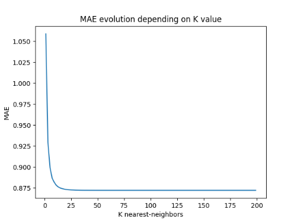
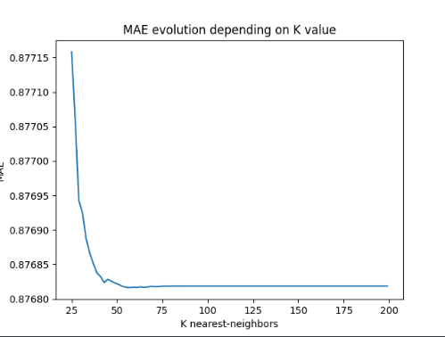
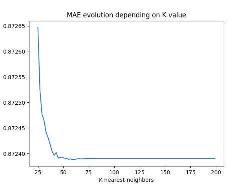
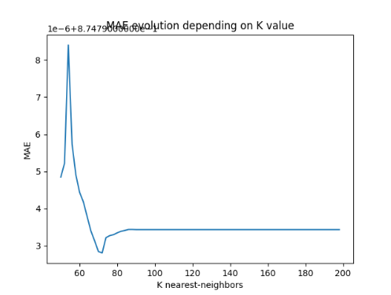

1. Given this data set and the algorithm of K-NN explained in class for user-based CF:

b) Sparsity Problem: find out the value for K that minimizes the MAE with 75% of missing ratings.

For this part, we are going to follow the same steps as the exercise 1.a. However, we are going to directly use the
probabilistic approach to improve precision of measures.

We just take care to allocate 75% of data to the test dataset.

For the first experiment, we define `k_list = list(range(1, 200, 2))`:

So we conclude easily that `K > 25`.

Next experiment with `k_list = list(range(25, 200, 2))`:

Again, we conclude easily that `K > 50`.

Next experiment with `k_list = list(range(50, 200, 2))`:

We see that K seems to be in [50:70] like in the exercise 1.a. So, we can make our conclusion now: the value of K seems
to remain the same as for the previous exercise.
