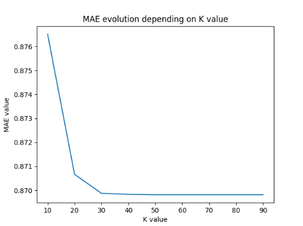

1. Given this data set and the algorithm of K-NN explained in class for user-based CF:

b) Sparsity Problem: find out the value for K that minimizes the MAE with 75% of missing ratings.

75% of missing ratings:
```python
from surprise.model_selection import train_test_split
...
trainset, testset = train_test_split(data, test_size=.75)
```



Here we see that the MAE seems to become stable when K = 30 is reached.