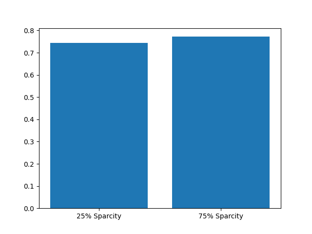

2
. Mitigation of sparsity problem: show how SVD (Funk variant) can provide a better MAE than user-based K-NN using the provided data set.

For this experiment we want to show that the SVD algorithm can produce better results with a lower MAE.
For this we run the algorithm once with .25 sparcity and once with .75 sparcity.

The following function executes this experiment

```
def runSVD(data, _testSize):
    # sample random trainset and testset
    # test set is made of 25% of the ratings.
    trainset, testset = train_test_split(data, test_size=_testSize)

    # We'll use the famous SVD algorithm.
    algo = SVD()

    # Train the algorithm on the trainset, and predict ratings for the testset
    algo.fit(trainset)
    predictions = algo.test(testset)

    return mae(predictions)
```

This function is run twice we can see in the following code snippet

```
barX = ["25% Sparcity", "75% Sparcity"]
barY = []

data = Dataset.load_builtin('ml-100k')

barY.append(runSVD(data, .25))
barY.append(runSVD(data, .75))

pyplot.bar(barX, barY)
pyplot.show()
```

and the result is plotted into the following bar chart.


The exact values are 0.7439 at .25 sparcity and 0.7721 at .75 sparcity.
The lowest MAE that was reached at .75 sparcity and a value of 60 for k using the K-nn algorithm was 0.80536 
This proves that the SVD algorithm is able to mitigate the sparcity problem and produce better results.
