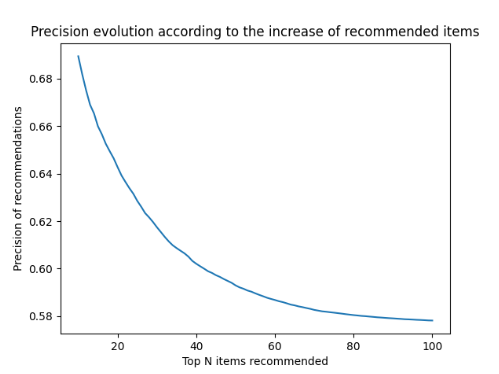
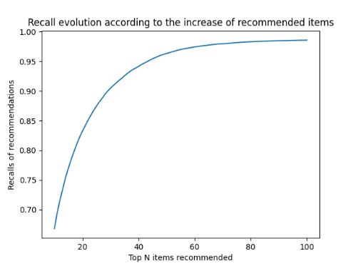
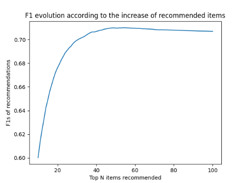

1. Top-N recommendations: calculate the precision, recall and F1 with different values for N (10..100) using user-based
   K-NN (with the best Ks)  and SVD. To do this, you must suppose that the relevant recommendations for a specific user
   are those rated with 4 or 5 stars in the data set.

a) With K-NN

First, we calculate predictions for all users:

```python
# Split dataset in two ones: one for training, the other one to realize tests
# (to determine MAE or top-N items for example)
train_set, test_set = train_test_split(data, test_size=.25)

# Use the "Pearson" similarity function for K-NN algorithm
sim_options_knn = {
    'name': "pearson",
    'user_based': True  # compute similarities between users
}
k = 60  # Number of nearest-neighbours for KNN algorithm

# Use KNN for predictions
algo = KNNBasic(k=k, sim_options=sim_options_knn)

# Train the algo and then create predictions from test dataset defined previously
predictions = algo.fit(train_set).test(test_set)

# Evaluate recommendations for all users with with precision, recall and F1
evaluate_recommendations_users(predictions)
```

Next, evaluate the recommendations of all users with precision, recall and F1 measures. The core of evaluation occurs
when we iterate over each user of the system to determine the measures of each recommendation:

```python
# Retain only predictions of the targeted user
user_predictions = get_user_predictions(predictions, raw_user_id)

# Determine the top N items of user defined previously
top_n_predictions = get_top_n_predictions(user_predictions, n_top_items)

# Calculate precision, recall and F1 for the obtained recommendations
precision = get_precision(top_n_predictions)
recall = get_recall(top_n_predictions, user_predictions)
f1 = get_f1(precision, recall)

precisions = np.append(precisions, precision)
recalls = np.append(recalls, recall)
f1s = np.append(f1s, f1)
```

***Note:** The code present all details about methods like `get_precision()`, `get_top_n_predictions()` and so on. We
show in the snippet only the most relevant parts of code.*

Then, we aggregate measure over an average one in order to store them for the current value of N:

```python
# Calculate average precision, recall and F1 for the current value of N
average_precision = sum(precisions) / nb_users
average_recall = sum(recalls) / nb_users
average_f1 = sum(f1s) / nb_users

# Store these average measures for this current value of N
precisions_over_n = np.append(precisions_over_n, average_precision)
recalls_over_n = np.append(recalls_over_n, average_recall)
f1s_over_n = np.append(f1s_over_n, average_f1)
```

After that, we simply display plots which represent the evolution of each measure when the N top items increase. We
obtain the following curves:

Precision:  


As expected, when N increase the precision decrease.

Recall:  


As opposed to the precision, when W increase the recall increase too.

F1:  


Like we can see for F1 measures, the highest value is raised when `N~=50` and then decrease a little. The decrease is
explained simply because the precision start to decrease more than the increase of recall.

So to conclude: based on the F1 measure and if we want to optimize it to determine the number of items to recommend, we
should select an N of 50. Anyway, we shouldn't use a value higher than 50 because we won't really find more relevant
items anymore.
