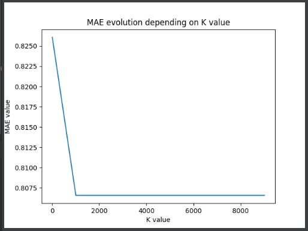
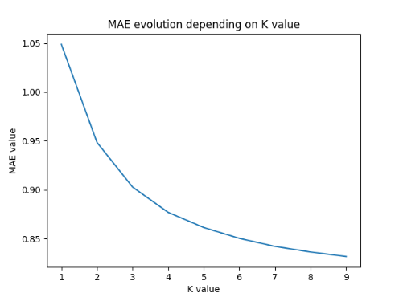
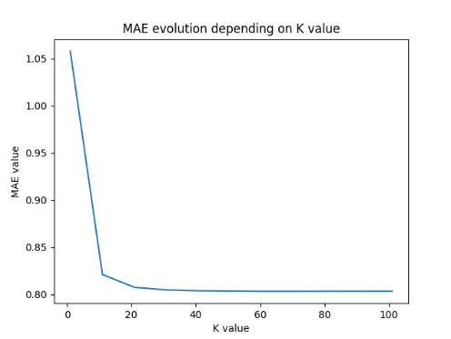
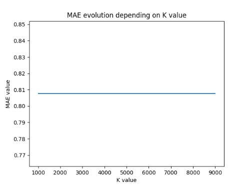
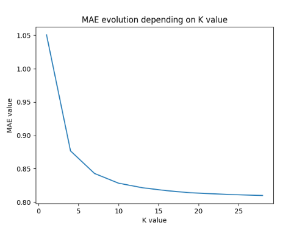
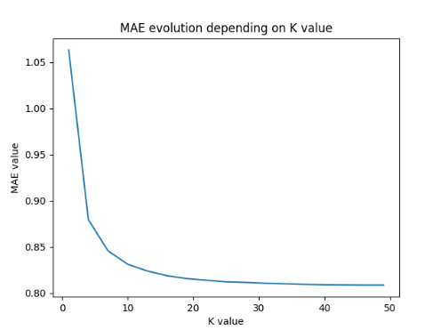
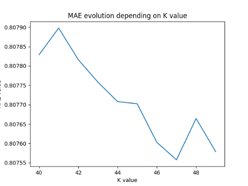
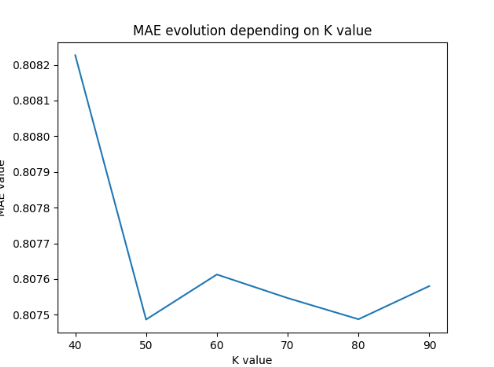

1. Given this data set and the algorithm of K-NN explained in class for user-based CF:

a) Find out the value for K that minimizes the MAE with 25% of missing ratings.

First of all, it's good to remind us our main goal: predict the ratings of all items of our dataset not rating yet by a
given user. After that, we just want to recommend to the same user the N items with the highest predicted rating.

Of course, according to algorithms used, the results can vary.

To realize this, we setup this program:

```python
data = Dataset.load_builtin('ml-100k')

sim_options_KNN = {'name': "pearson",
                   'user_based': True  # compute similarities between users
                   }
# number of neighbors
k_list = list(range(10, 10000, 1000))
print(len(k_list))
maes = []

trainset, testset = train_test_split(data, test_size=.25)

for k in k_list:
    algo = KNNBasic(k=k, sim_options=sim_options_KNN)
    predictions = algo.fit(trainset).test(testset)
    maes.append(mae(predictions))

pyplot.plot(k_list, maes)
pyplot.title('MAE evolution depending on K value')
pyplot.xlabel('K value')
pyplot.ylabel('MAE value')
pyplot.show()
```

Here we specify that we want to use the KNN algorithm to predict the K nearest neighbours of a given user.

We use a dichotomy approach by starting with big K values `range(10, 10000, 1000)`. We obtain the following graphic:


We see that when `K > 1000`, the MAE is equal to `0.8015` constantly.

So we conclude here that the K shouldn't overflow `1000` as value.

According to the previous observation, we decide to try with small values starting from 1 to 10 and we obtain the
follow:










MAE = 0.8088 for K=[46-49] => we find the highest K-value which permit to obtain the lower MAE value.
With another trainset and testset, we obtain MAE = 0.8027 for K = 46, MAE = 0.8024 for K = 49.
Anyway, let's say K=50 is the highest value





